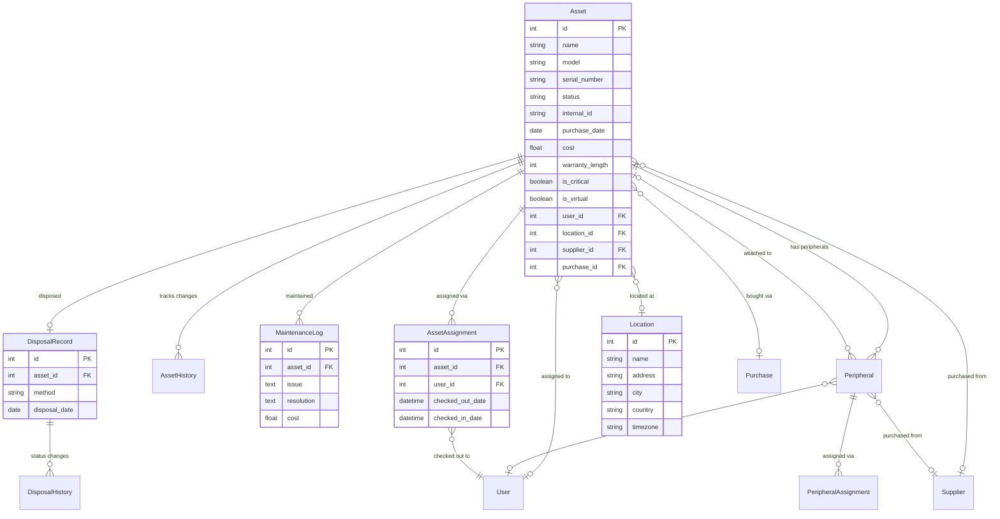
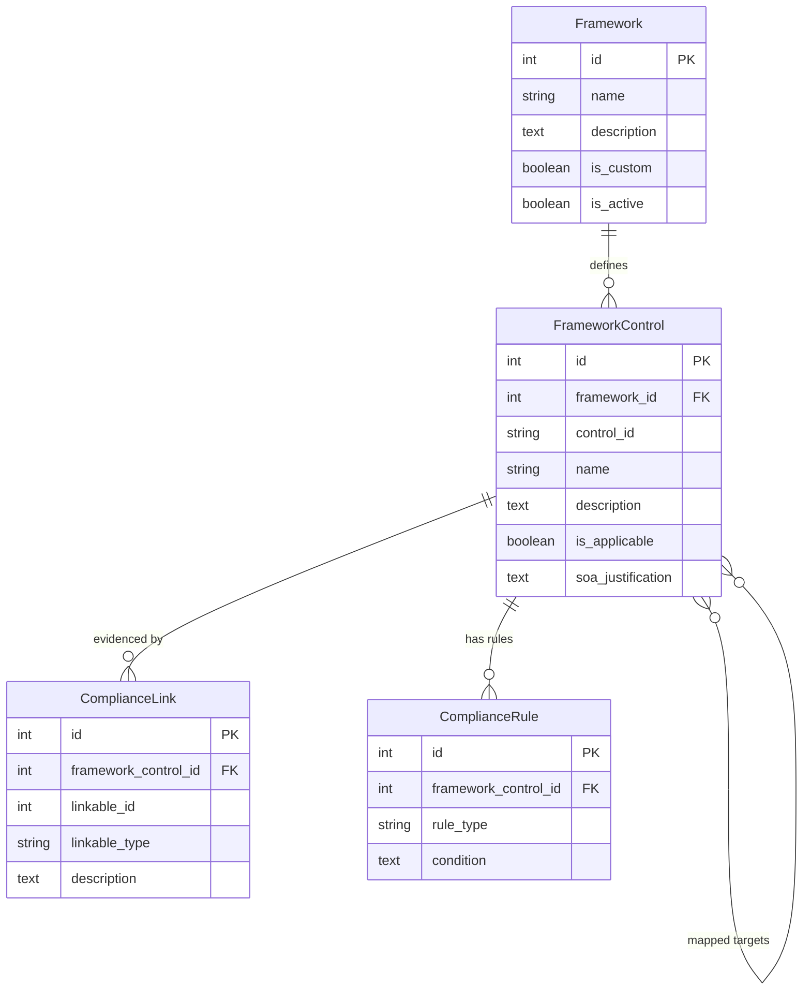
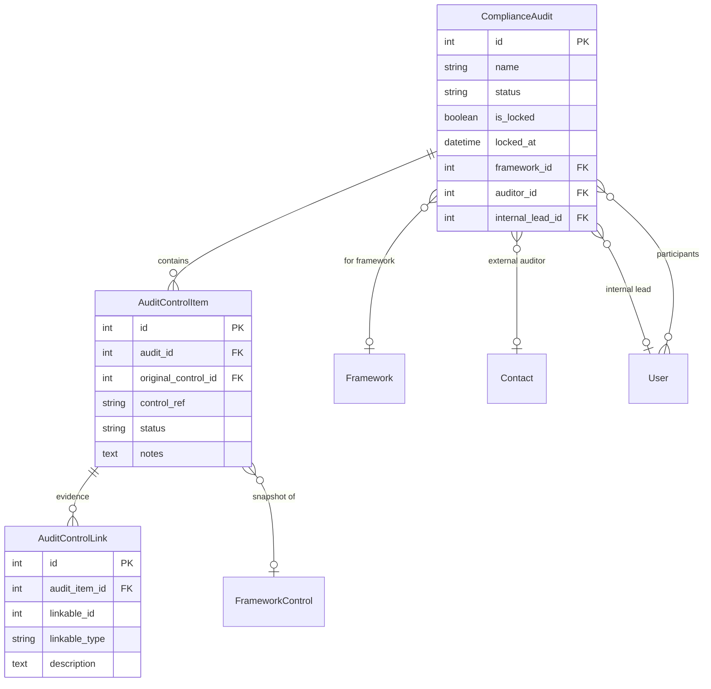
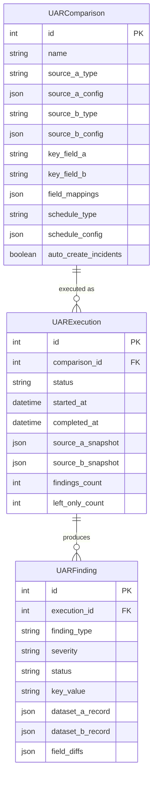
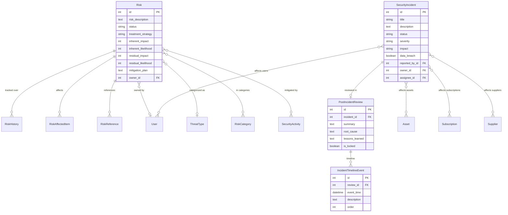
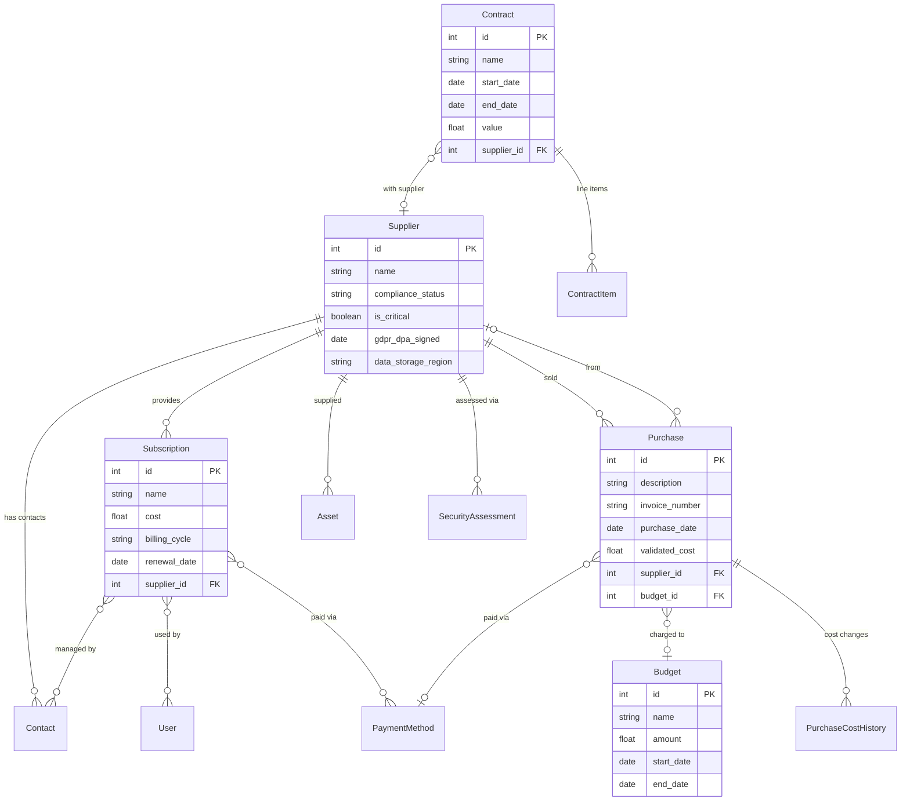
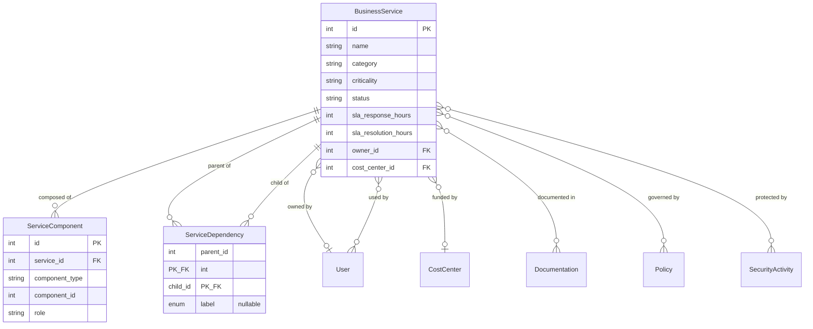
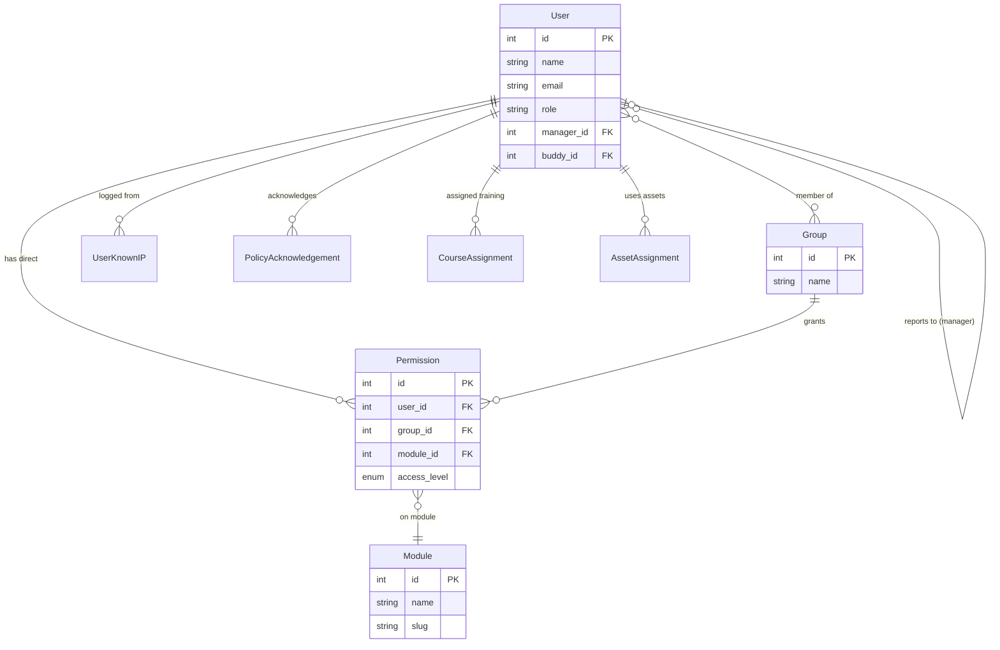
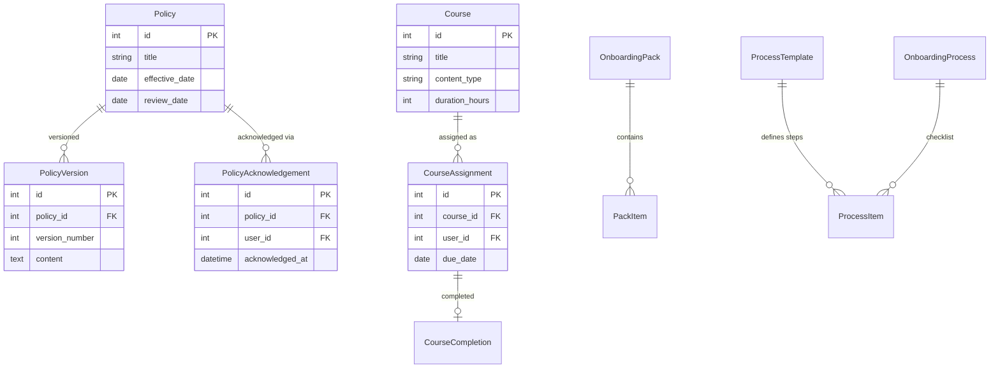
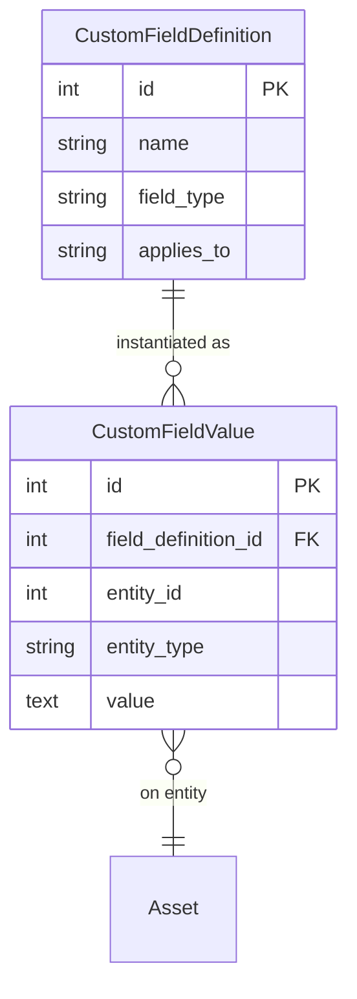

# Data Model

OpsDeck uses SQLAlchemy as its ORM with PostgreSQL as the sole supported database. The data model is organized into domain-specific model files with shared patterns for cross-cutting concerns.

## Overview

The full schema has 80+ tables across 27 model files. Rather than one monolithic diagram, the relationships are documented below by domain.

---

## Assets & hardware

Tracks hardware lifecycle from procurement to disposal, with assignment history, maintenance, and peripherals.

---

## Compliance & frameworks

The core governance engine: frameworks define requirements, controls define individual rules, and compliance links connect evidence from any entity to any control.

!!! note "Polymorphic linking"
    `ComplianceLink.linkable_type` stores the entity class name (Asset, Policy, Supplier, etc.) and `linkable_id` stores its primary key. This avoids a separate junction table per entity type.

---

## Audits

Point-in-time compliance snapshots with immutable evidence for auditors.

---

## User access reviews (UAR)

Automated comparison engine for detecting access discrepancies between systems.

---

## Risk & security

Risk register, security incidents with timeline tracking, and post-incident reviews.

---

## Procurement & vendors

Supplier management, contracts, subscriptions, purchases, and budgets.

---

## Service catalog

Business services mapped to technical components with typed dependency tracking.

The `ServiceDependency` association model connects services with an optional typed label from a controlled vocabulary: `hosts`, `authenticates`, `provides_access`, `stores_data`, `processes_data`, `monitors`, `backs_up`, `routes_traffic`, `calls_api`, `sends_data`. Existing dependencies without a label continue to work normally.

---

## People & authentication

Users, groups, RBAC permissions, org chart, and known IP tracking.

---

## Policies, training & onboarding

Governance workflows: policy acknowledgment, training tracking, and employee lifecycle.

---

## Cross-cutting patterns

### Polymorphic linking

Both `ComplianceLink` and `Link` use a `linkable_type` + `linkable_id` pattern to connect any entity to compliance controls or to other entities without per-type junction tables. `RiskAffectedItem` and `RiskReference` follow the same pattern.

### CustomPropertiesMixin

Models that include this mixin (`Asset`, `User`, `Peripheral`) support arbitrary custom fields:

### Audit logging

Every mutation generates an `AuditLog` record via the SQLAlchemy event listener:

| Column | Content |
|---|---|
| `user_id` | Who made the change |
| `action` | INSERT / UPDATE / DELETE |
| `table_name` | Affected table |
| `record_id` | Affected record |
| `timestamp` | UTC timestamp |
| `changes` | JSON diff (DeepDiff output) |

### Soft deletes and history

Most entities use `is_archived` flags rather than physical deletion. History tables (`AssetHistory`, `RiskHistory`, `CostHistory`, `DisposalHistory`) capture point-in-time snapshots for trending and timeline visualization.
