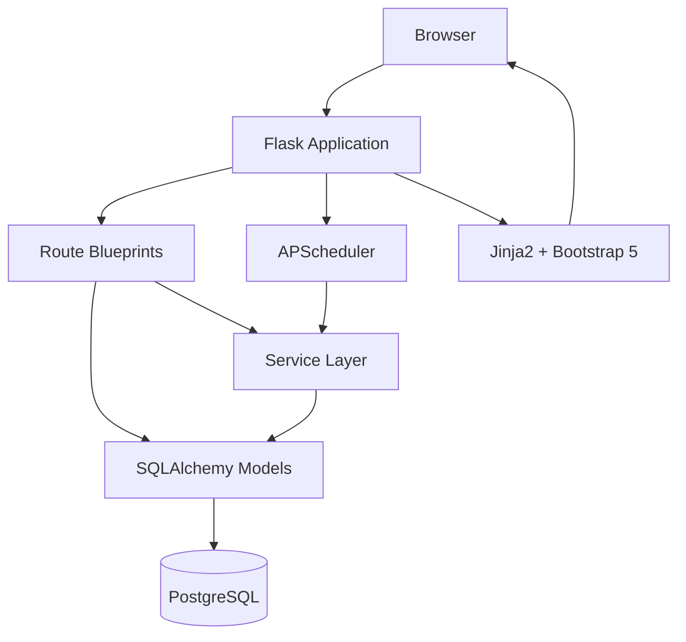

# Architecture Reference

This section documents the technical architecture of OpsDeck, including the system design, data model, library choices, and the reasoning behind key decisions.

## Overview

OpsDeck is a Python/Flask monolith backed by PostgreSQL. It follows a layered architecture with clear separation between models, routes, services, and utilities. The frontend uses server-rendered Jinja2 templates with Bootstrap 5, enhanced by client-side JavaScript libraries for rich interactions.

## Sections

| Document | Covers |
|---|---|
| [System Overview](overview.md) | High-level architecture, request flow, layer responsibilities |
| [Data Model](data-model.md) | Entity relationships, core tables, polymorphic patterns |
| [Permissions & RBAC](permissions.md) | Role-based access control, module-level permissions, caching |
| [Decision Records](decisions.md) | ADRs — why Flask, why monolith, why Elastic License, etc. |
| [Dependencies](dependencies.md) | Every Python and JS dependency with justification |
| [Frontend Stack](frontend.md) | Bootstrap 5, Chart.js, Tom Select, Mermaid, DataTables |
| [API Design](api-design.md) | REST conventions, authentication, marshmallow schemas |
| [Scheduler & Jobs](scheduler.md) | APScheduler setup, recurring jobs, compliance drift |
| [Security Model](security-model.md) | Auth flow, session management, encryption, CSP, rate limiting |
