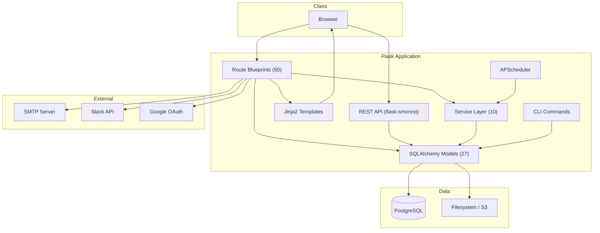

# System Overview

OpsDeck is a Python/Flask monolith backed by PostgreSQL, designed as a single deployable unit that covers IT operations, governance, compliance, and vendor management.

## Design philosophy

Three principles drive every architectural choice:

**Compliance-first design.** All features are built with audit requirements in mind. The system maintains comprehensive logs, enforces data integrity, and provides clear audit trails for all operations. Immutable audit snapshots, soft deletes, and centralized logging are defaults, not afterthoughts.

**Integrated data model.** Rather than treating assets, users, services, and compliance as separate domains, OpsDeck uses an interconnected data model where entities can be linked across domains via polymorphic `ComplianceLink` and `Link` records. This enables traceability and impact analysis — you can trace from a business service down to the hardware it runs on, the vendor who supplies it, and the compliance controls that govern it.

**Extensibility without complexity.** The platform uses a modular blueprint architecture. Each functional area has its own route file, model file, and template directory. Features can be added or disabled without affecting core functionality. Configuration is environment-based rather than database-driven where possible.

## High-level architecture



## Request lifecycle

A typical request flows through these layers:

1. **Gunicorn** accepts the HTTP connection and forwards to the Flask WSGI app.
2. **Flask middleware** runs: session loading (Flask-Login), CSRF validation (Flask-WTF), security headers (flask-talisman), rate limiting (Flask-Limiter).
3. **Route blueprint** matches the URL. The route function checks permissions via the `@permission_required` decorator, which queries the permissions cache.
4. **Business logic** runs — either inline in the route or delegated to a service (e.g., `compliance_drift_service`, `uar_service`, `finance_service`).
5. **SQLAlchemy models** interact with PostgreSQL. The audit listener (`utils/audit_listener.py`) captures all INSERT/UPDATE/DELETE events for the audit log.
6. **Jinja2 template** renders the response using Bootstrap 5 layout inheritance. For API routes, marshmallow schemas serialize the response to JSON.

## Module structure

```
src/
├── __init__.py              # App factory, blueprint registration, config
├── api.py                   # REST API setup (flask-smorest)
├── cli.py                   # CLI commands: import, seed, admin tasks
├── extensions.py            # Flask extension instances
├── schemas.py               # Marshmallow schemas for API serialization
├── notifications.py         # Email and webhook notification engine
├── seeder.py                # Demo data seeder
├── seeder_prod.py           # Production bootstrap seeder
│
├── models/                  # SQLAlchemy models (27 files, ~5,600 lines)
│   ├── core.py              # Shared: Attachment, Tag, Link, CostCenter, CustomFields
│   ├── auth.py              # User, Group, OrgChartSnapshot, KnownIP
│   ├── assets.py            # Asset, Peripheral, Software, Location, Maintenance, Disposal
│   ├── security.py          # Framework, Control, Risk, Incident, ComplianceLink/Rule
│   ├── audits.py            # ComplianceAudit, AuditControlItem, AuditControlLink
│   ├── uar.py               # UARComparison, UARExecution, UARFinding
│   ├── procurement.py       # Supplier, Subscription, Contract, Purchase, Budget
│   ├── services.py          # BusinessService, ServiceComponent
│   ├── policy.py            # Policy, PolicyVersion, PolicyAcknowledgement
│   ├── training.py          # Course, CourseAssignment, CourseCompletion
│   ├── onboarding.py        # OnboardingPack, ProcessTemplate, ProcessItem
│   ├── credentials.py       # Credential, CredentialSecret (Fernet-encrypted)
│   ├── risk_assessment.py   # RiskAssessment, RiskAssessmentItem, Evidence
│   ├── ...                  # hiring, bcdr, finance, certificates, etc.
│   └── permissions.py       # Module, Permission, AccessLevel enum
│
├── routes/                  # Flask blueprints (50 files, ~15,000 lines)
│   ├── main.py              # Dashboard, health check, universal search
│   ├── assets.py            # CRUD + lifecycle transitions
│   ├── compliance.py        # Compliance dashboard, drift, evidence linking
│   ├── audits.py            # Audit creation, cloning, locking, export
│   ├── ...                  # One file per functional module
│   └── search.py            # Universal faceted search
│
├── services/                # Business logic layer (10 files, ~3,000 lines)
│   ├── compliance_service.py        # Score calculation, status aggregation
│   ├── compliance_drift_service.py  # Snapshot capture, drift detection
│   ├── uar_service.py               # Comparison execution, finding generation
│   ├── finance_service.py           # Budget tracking, forecast, exchange rates
│   ├── permissions_service.py       # RBAC resolution
│   ├── permissions_cache.py         # In-memory permission caching
│   ├── search_service.py            # Cross-entity search
│   ├── audit_export_service.py      # Evidence package generation
│   └── slack_service.py             # Slack notification integration
│
├── utils/                   # Shared utilities (9 files)
│   ├── audit_listener.py    # SQLAlchemy event listener for audit logging
│   ├── uar_engine.py        # Core diff engine for UAR comparisons
│   ├── dependency_graph.py  # Service dependency resolution
│   ├── differ.py            # DeepDiff wrapper for change detection
│   ├── helpers.py           # Shared helper functions
│   ├── timezone_helper.py   # Timezone-aware datetime handling
│   └── logger.py            # ECS-format structured logging setup
│
├── templates/               # Jinja2 templates (~40,000 lines)
│   ├── layout.html          # Base layout with Bootstrap 5
│   ├── components/          # Reusable UI components (modals, forms, tables)
│   └── [module]/            # One directory per functional module
│
└── static/                  # CSS, JS, vendor assets
    ├── css/
    ├── js/
    └── vendor/              # Copied from node_modules via copy-assets.js
```

## Key patterns

### Polymorphic linking

The `ComplianceLink` model connects any "linkable" entity (asset, policy, service, supplier, etc.) to any framework control. This is how evidence is linked to compliance requirements without requiring a separate junction table per entity type.

Similarly, the `Link` model provides generic entity-to-entity linking for cross-domain relationships (e.g., linking a risk to an asset, or a service to a contract).

### Custom properties

The `CustomPropertiesMixin` allows any model that includes it (currently `Asset`, `User`, `Peripheral`) to have arbitrary key-value custom fields defined at the organization level via `CustomFieldDefinition`.

### Audit logging

The `audit_listener.py` hooks into SQLAlchemy's `after_insert`, `after_update`, and `after_delete` events. Every mutation to a tracked model generates an `AuditLog` record with the user, timestamp, operation type, and a JSON diff of changed fields (powered by DeepDiff).

### Permission caching

The RBAC system resolves permissions per user per module. To avoid repeated database queries on every request, resolved permissions are cached in-memory via `permissions_cache.py` and invalidated when roles or group memberships change.
