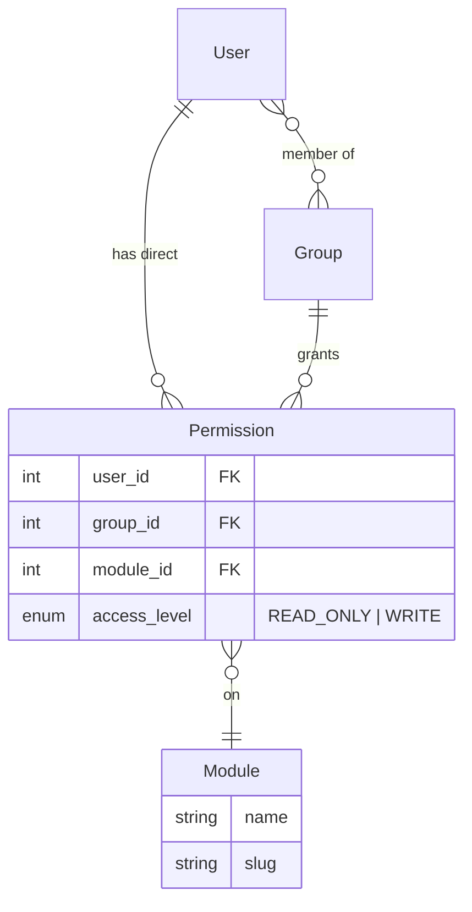

# Permissions & RBAC

OpsDeck implements a module-level role-based access control system with group inheritance and in-memory caching.

## Permission model

Permissions are defined per module (assets, compliance, risk, etc.) with two access levels:

The `AccessLevel` enum has two values:

| Level | Grants |
|---|---|
| `READ_ONLY` | View access to module data |
| `WRITE` | Create, update, and delete access (implies read) |

## Resolution algorithm

When a request hits a `@permission_required(module, level)` decorator:

1. Check the permission cache for the user.
2. If not cached, resolve permissions:
    - Load direct permissions (`Permission` records where `user_id` matches).
    - Load group permissions (from all groups the user belongs to).
    - Merge: for each module, take the highest access level (WRITE > READ_ONLY).
3. Cache the resolved permission map.
4. Check if the user has the required level on the requested module.

## Group-based permissions

Groups simplify permission management for teams:

- Create a group (e.g., "IT Operations," "Compliance Team").
- Assign module permissions to the group.
- Add users as members.
- All members inherit the group's permissions.

When a user belongs to multiple groups, permissions are merged — the highest level wins.

## Permission caching

The `PermissionsCache` is a singleton in-memory dictionary:

- **Key:** user ID.
- **Value:** dict mapping module slugs to access level names.
- **Invalidation:** triggered when group membership or role assignment changes (calling `permissions_cache.invalidate(user_id)` or `permissions_cache.invalidate()` for global clear).

This avoids repeated database queries for permission checks on every request. The cache lives in the application process — in multi-worker deployments, each worker maintains its own cache.

## Admin bypass

Users with the `Admin` role bypass all permission checks. Admin status is checked before the permission resolution chain runs.

## API permissions

API tokens inherit the owning user's permissions. The `check_token()` before-request hook resolves the user from the token and applies the same RBAC checks.
