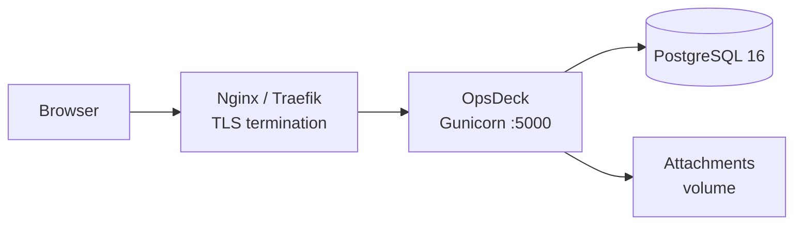

# Docker Compose Deployment

Production-grade deployment using Docker Compose with PostgreSQL, persistent storage, and health checks.

## Prerequisites

- Docker Engine 24+
- Docker Compose v2

## docker-compose.yml

The repository includes a `docker-compose.yml` configured for development (debug mode, demo data, no healthcheck on the web service). For production, use the following as a starting point:



```yaml
services:
  web:
    build:
      context: .
    ports:
      - "5000:5000"
    volumes:
      - ./data/attachments:/app/data/attachments
    environment:
      - DATABASE_URL=postgresql://opsdeck:${DB_PASSWORD}@db:5432/opsdeck
      - SECRET_KEY=${SECRET_KEY}
      - FLASK_DEBUG=0
      - DEFAULT_ADMIN_EMAIL=${ADMIN_EMAIL:-admin@example.com}
      - DEFAULT_ADMIN_INITIAL_PASSWORD=${ADMIN_PASSWORD:-admin123}
    env_file:
      - .env
    depends_on:
      db:
        condition: service_healthy
    healthcheck:
      test: ["CMD", "curl", "-f", "http://localhost:5000/health"]
      interval: 30s
      timeout: 10s
      retries: 3
      start_period: 40s
    restart: unless-stopped

  db:
    image: postgres:16-alpine
    restart: unless-stopped
    environment:
      POSTGRES_USER: opsdeck
      POSTGRES_PASSWORD: ${DB_PASSWORD}
      POSTGRES_DB: opsdeck
    volumes:
      - postgres_data:/var/lib/postgresql/data
    healthcheck:
      test: ["CMD-SHELL", "pg_isready -U opsdeck -d opsdeck"]
      interval: 10s
      timeout: 5s
      retries: 5

volumes:
  postgres_data:
```

## Configuration

Create a `.env` file with production values:

```bash
SECRET_KEY=your-long-random-secret-key-here
DB_PASSWORD=strong-database-password
ADMIN_EMAIL=admin@yourcompany.com
ADMIN_PASSWORD=InitialSecurePassword123!
```

!!! danger
    Never commit `.env` with production credentials to version control.

See [Environment Variables](environment-variables.md) for the full reference.

## Build and run

```bash
docker-compose up -d --build
```

The `entrypoint.sh` script handles first-run initialization automatically:

1. Installs the enterprise plugin if `ENTERPRISE_ENABLED=True` and the plugin directory exists.
2. Detects and recovers stale Alembic revisions (e.g., after a migration squash).
3. Runs `flask db upgrade` to apply database migrations.
4. Runs `flask init-db` to create the admin user.
5. Runs `flask seed-db-prod` to load compliance frameworks and threat catalogs.
6. Runs `flask seed-db-demodata` if `SEED_DEMO_DATA=True` (development only).
7. Seeds enterprise data (`flask seed-connectors`, `flask seed-ai-profiles`) if enterprise is enabled.
8. Starts Gunicorn with the configured workers and threads.

Verify the deployment:

```bash
docker-compose ps
docker-compose logs -f web
```

## Data persistence

| Data | Container path | Host mount |
|---|---|---|
| Database | `/var/lib/postgresql/data` | `postgres_data` named volume |
| Attachments | `/app/data/attachments` | `./data/attachments` bind mount |
| Logs | `/app/logs` | Optional bind mount |

## TLS termination

Do not expose port 5000 directly to the internet. Place a reverse proxy in front:

=== "Nginx"

    ```nginx
    server {
        listen 443 ssl;
        server_name opsdeck.yourcompany.com;

        ssl_certificate /etc/letsencrypt/live/opsdeck.yourcompany.com/fullchain.pem;
        ssl_certificate_key /etc/letsencrypt/live/opsdeck.yourcompany.com/privkey.pem;

        location / {
            proxy_pass http://127.0.0.1:5000;
            proxy_set_header Host $host;
            proxy_set_header X-Real-IP $remote_addr;
            proxy_set_header X-Forwarded-For $proxy_add_x_forwarded_for;
            proxy_set_header X-Forwarded-Proto $scheme;
        }
    }
    ```

=== "Traefik"

    Add labels to the `web` service in `docker-compose.yml`:

    ```yaml
    labels:
      - "traefik.enable=true"
      - "traefik.http.routers.opsdeck.rule=Host(`opsdeck.yourcompany.com`)"
      - "traefik.http.routers.opsdeck.tls.certresolver=letsencrypt"
    ```

!!! important "Set `TRUST_PROXY=1` behind a proxy"
    The proxy forwards `X-Forwarded-Proto`/`Host`, but the app ignores them unless
    `TRUST_PROXY=1` is set on the `web` service. Without it, the app builds URLs from
    the internal host — email links and OAuth callbacks point to the wrong place, and
    form redirects (e.g. offboarding transfers) can hang. See [Environment Variables](environment-variables.md#general).

## Network isolation

Isolate the database from external access:

```yaml
networks:
  frontend:
  backend:

services:
  web:
    networks: [frontend, backend]
  db:
    networks: [backend]
```

## Performance tuning

**Gunicorn workers and threads.** Configured via environment variables:

- `GUNICORN_WORKERS` — number of worker processes (default: `2`).
- `GUNICORN_THREADS` — threads per worker (default: `4`).

The entrypoint uses the `gthread` worker class with `--max-requests 1000` and `--max-requests-jitter 50` to periodically recycle workers and prevent memory leaks.

**Database connection pool.** Configure in `.env` or application config:

```
SQLALCHEMY_POOL_SIZE=10
SQLALCHEMY_POOL_RECYCLE=3600
```

**Container resource limits:**

```yaml
deploy:
  resources:
    limits:
      cpus: '2'
      memory: 2G
    reservations:
      cpus: '1'
      memory: 1G
```

## Backup

See [Backup & Restore](backup-restore.md) for automated backup scripts.

Quick manual backup:

```bash
# Database
docker-compose exec -T db pg_dump -U opsdeck opsdeck | gzip > backup_$(date +%Y%m%d).sql.gz

# Attachments
tar -czf attachments_$(date +%Y%m%d).tar.gz ./data/attachments
```

## Troubleshooting

**Container won't start.** Check `docker-compose logs web`. Common causes: wrong `DATABASE_URL`, port 5000 already in use, missing `.env` file.

**Database migration errors.** Run `docker-compose exec web flask db upgrade` manually to see detailed errors.

**Performance issues.** Check `docker stats` for resource usage. Enable query logging with `SQLALCHEMY_ECHO=True` to find slow queries.
