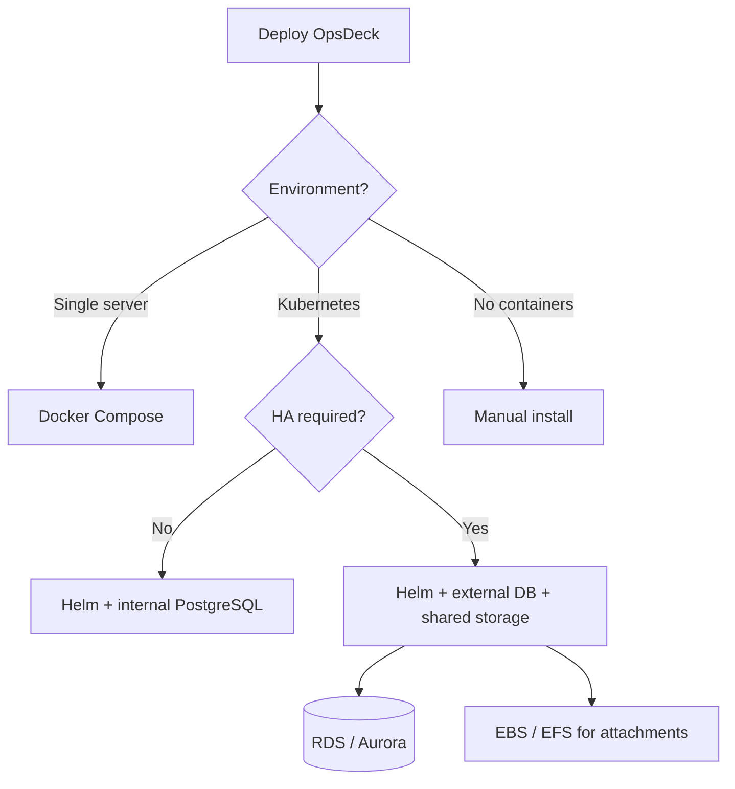

# Deployment Guide

This section covers how to install, configure, and operate OpsDeck in production environments.

## Deployment options

| Method | Best for | Complexity |
|---|---|---|
| [Local Python (venv)](quickstart.md) | Development, testing | Minimal |
| [Docker Compose](docker.md) | Small teams, single-server deployments | Low |
| [Kubernetes (Helm)](kubernetes.md) | Scalable, multi-node, cloud-native environments | Medium |
| [Kubernetes (ArgoCD)](kubernetes.md#argocd-deployment) | GitOps-driven environments | Medium |
| [Manual](manual.md) | Air-gapped environments, custom setups | High |

## Quick path

1. Start with [Quick Start](quickstart.md) for a local dev instance
2. Review [Environment Variables](environment-variables.md) for configuration
3. Pick your deployment method above
4. Set up [Backup & Restore](backup-restore.md)
5. Review [Security Hardening](security-hardening.md) before going live

## Requirements

- **Python** 3.11+ (Docker image ships with 3.13)
- **PostgreSQL** 15+ (16 recommended)
- **Storage** for attachments (local filesystem or S3-compatible)

## High availability

OpsDeck supports multi-replica deployments when using:

- **External database** (RDS, Aurora, or any managed PostgreSQL) instead of the internal PostgreSQL pod.
- **Shared storage** (EBS, EFS, or S3-compatible) for attachments, so all replicas access the same files.
- **Identical `SECRET_KEY`** across all replicas (from a shared Kubernetes Secret or environment).

See the [Kubernetes scaling section](kubernetes.md#scaling) for details.
