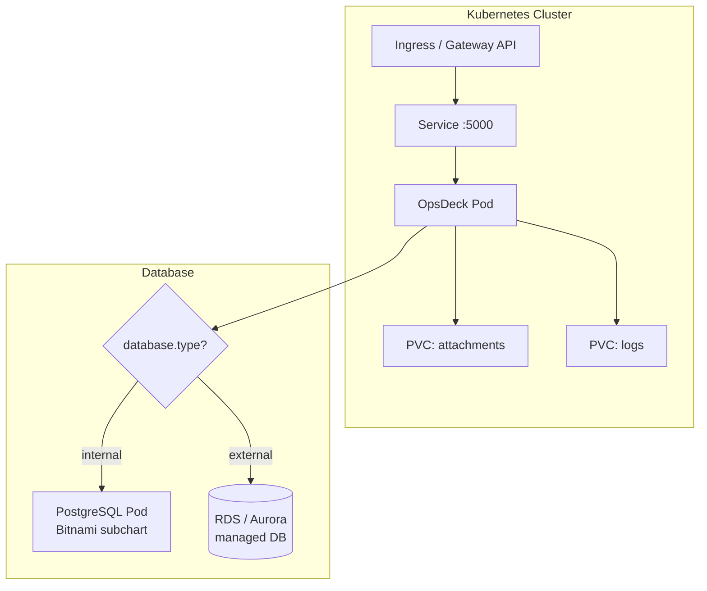
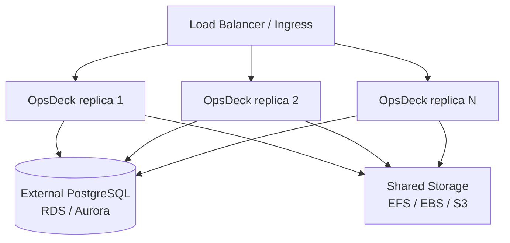

# Kubernetes Deployment (Helm)

Deploy OpsDeck on Kubernetes using the included Helm chart, with support for internal or external PostgreSQL, persistent storage, and Ingress.

## Architecture



## Prerequisites

- Kubernetes cluster v1.19+
- Helm 3.0+
- `kubectl` configured for your cluster

## Chart structure

```
helm/
├── Chart.yaml          # Chart metadata and PostgreSQL subchart dependency
├── Chart.lock
├── values.yaml         # Default configuration
├── charts/             # Bundled PostgreSQL subchart
└── templates/
    ├── deployment.yaml
    ├── service.yaml
    ├── ingress.yaml
    └── pvc.yaml
```

## Installation

### 1. Create namespace and secrets

```bash
kubectl create namespace opsdeck

kubectl create secret generic opsdeck-secrets \
  --from-literal=secret-key='$(openssl rand -hex 32)' \
  --from-literal=admin-email='admin@yourcompany.com' \
  --from-literal=admin-password='SecurePassword123!' \
  -n opsdeck
```

### 2. Configure values

The key decision is database mode — **internal** (deploys a PostgreSQL pod) or **external** (uses an existing database like RDS/Aurora):

=== "Internal PostgreSQL"

    The Bitnami PostgreSQL subchart is disabled by default. To deploy an in-cluster database, enable it explicitly:

    ```yaml
    # values.yaml
    database:
      type: internal

    postgresql:
      enabled: true        # Must be set to true — disabled by default
      auth:
        username: opsdeck
        password: opsdeck_password
        database: opsdeck_db
      primary:
        persistence:
          enabled: true
          size: 1Gi
    ```

    !!! warning
        Internal PostgreSQL is not designed for multi-replica deployments. Use external PostgreSQL for high availability.

=== "External PostgreSQL (RDS/Aurora)"

    ```yaml
    # values.yaml
    database:
      type: external
      external:
        host: "my-aurora-db.aws.com"
        port: 5432
        username: "opsdeck"
        database: "opsdeck_prod"
        existingSecret:
          name: "opsdeck-db-secret"
          key: "password"

    postgresql:
      enabled: false       # Ensure internal DB is disabled
    ```

### 3. Configure persistent storage

```yaml
persistence:
  logs:
    enabled: true
    size: 500Mi
    storageClass: ""       # Uses cluster default
    existingClaim: ""      # Or reference an existing PVC
  
  attachments:
    enabled: true
    size: 5Gi
    storageClass: ""
    existingClaim: ""
```

### 4. Install

```bash
helm upgrade --install opsdeck ./helm \
  --namespace opsdeck \
  --set image.tag=latest
```

### 5. Verify

```bash
kubectl get pods -n opsdeck
kubectl logs -f deployment/opsdeck -n opsdeck
```

## Ingress

Enable and configure Ingress in `values.yaml`:

```yaml
ingress:
  enabled: true
  className: nginx
  annotations:
    cert-manager.io/cluster-issuer: letsencrypt-prod
  hosts:
    - host: opsdeck.yourcompany.com
      paths:
        - path: /
          pathType: Prefix
  tls:
    - secretName: opsdeck-tls
      hosts:
        - opsdeck.yourcompany.com
```

## ArgoCD deployment

For GitOps workflows, create an ArgoCD Application manifest:

```yaml
apiVersion: argoproj.io/v1alpha1
kind: Application
metadata:
  name: opsdeck
  namespace: argocd
spec:
  project: default
  source:
    repoURL: 'https://github.com/pixelotes/opsdeck.git'
    targetRevision: HEAD
    path: helm/
    helm:
      valueFiles:
        - values.yaml
  destination:
    server: 'https://kubernetes.default.svc'
    namespace: opsdeck
  syncPolicy:
    automated:
      prune: true
      selfHeal: true
    syncOptions:
      - CreateNamespace=true
```

```bash
kubectl apply -f application.yaml
```

## Gateway API

As an alternative to Ingress, OpsDeck supports the Kubernetes Gateway API:

```yaml
gatewayApi:
  enabled: true
  gatewayName: "my-gateway"
  namespace: "default"
  hostname: "opsdeck.example.com"
```

This creates an `HTTPRoute` resource pointing to the OpsDeck service. Ensure your cluster has a Gateway API implementation installed (e.g., Envoy Gateway, Istio, Cilium).

## Logging sidecar

The chart supports a Filebeat sidecar for shipping logs to Elasticsearch. Credentials are read from a Kubernetes Secret that you manage.

### 1. Create the Elasticsearch credentials secret

```bash
kubectl create secret generic elastic-credentials \
  --from-literal=ELASTICSEARCH_USERNAME=elastic \
  --from-literal=ELASTICSEARCH_PASSWORD='your-password' \
  -n opsdeck
```

### 2. Enable the sidecar in your values

```yaml
loggingSidecar:
  enabled: true
  image:
    repository: docker.elastic.co/beats/filebeat
    tag: 8.5.1
  elasticsearch:
    host: "elasticsearch.monitoring.svc.cluster.local"
    port: 9200
    protocol: "http"
    existingSecret: "elastic-credentials"
```

The Secret must contain two keys: `ELASTICSEARCH_USERNAME` and `ELASTICSEARCH_PASSWORD`. Filebeat picks them up as environment variables at runtime.

When enabled, Filebeat runs alongside the OpsDeck container and forwards application logs in ECS format.

## Scaling

OpsDeck can run multiple replicas behind the Kubernetes Service load balancer:



Requirements for multi-replica:

- **External PostgreSQL** — internal PostgreSQL is a single pod and not designed for HA.
- **Shared storage** for attachments — use a ReadWriteMany PVC (EFS) or S3-compatible storage so all replicas access the same files.
- **Identical `SECRET_KEY`** across all replicas (from the shared Kubernetes Secret).

## values.yaml reference

| Key | Default | Description |
|---|---|---|
| `image.repository` | `pixelotes/opsdeck` | Container image |
| `image.tag` | `latest` | Image tag |
| `image.pullPolicy` | `IfNotPresent` | Pull policy |
| `service.type` | `ClusterIP` | Service type |
| `service.port` | `5000` | Service port |
| `database.type` | `internal` | `internal` or `external` |
| `postgresql.enabled` | `false` | Enable internal PostgreSQL pod (must set `true` for internal mode) |
| `postgresql.auth.username` | `opsdeck` | Internal DB username |
| `postgresql.auth.password` | `opsdeck_password` | Internal DB password |
| `postgresql.auth.database` | `opsdeck_db` | Internal DB name |
| `persistence.logs.enabled` | `true` | Enable log persistence |
| `persistence.logs.size` | `500Mi` | Log volume size |
| `persistence.attachments.enabled` | `true` | Enable attachment persistence |
| `persistence.attachments.size` | `5Gi` | Attachment volume size |
| `ingress.enabled` | `false` | Enable Ingress resource |
| `gatewayApi.enabled` | `false` | Enable Gateway API HTTPRoute |
| `loggingSidecar.enabled` | `false` | Enable Filebeat logging sidecar |
| `loggingSidecar.elasticsearch.existingSecret` | `""` | Secret with `ELASTICSEARCH_USERNAME` and `ELASTICSEARCH_PASSWORD` keys |
| `existingSecret` | `""` | Name of an existing Secret for env vars (Sealed Secrets, external-secrets) |
