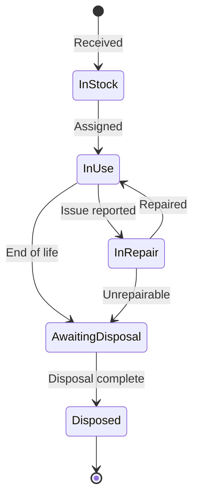

# Hardware Assets

The asset management module tracks IT hardware from procurement through disposal, with maintenance logging, assignment history, warranty tracking, and compliance linking.

## Asset lifecycle states

| State | Description |
|---|---|
| **In Stock** | Asset received but not yet deployed. Stored at a location. |
| **In Use** | Assigned to a user or deployed to a location. |
| **In Repair** | Under maintenance. Automatically tracked via maintenance logs. |
| **Awaiting Disposal** | Approved for retirement. Pending disposal process. |
| **Disposed** | Retired. Record preserved for audit purposes. |

## Creating an asset

1. Navigate to **Assets → Asset List**.
2. Click **Add Asset**.
3. Fill in the required fields: name, asset type, model, serial number.
4. Optional fields: purchase date, cost, warranty expiry, supplier, location.
5. Assign to a user (optional — can be done later).
6. Upload photos or documentation as attachments.
7. Save.

The asset is created in **In Stock** status by default unless assigned to a user.

## Assignment and transfers

Assigning an asset to a user:

1. Open the asset detail page.
2. Click **Assign** or edit the assignment field.
3. Select the user. The status changes to **In Use** automatically.
4. An `AssetAssignment` record is created, preserving the assignment history.

Transferring between users:

1. Change the assigned user on the asset detail page.
2. The previous assignment is closed (end date set) and a new one is created.
3. Full assignment history is visible in the asset's timeline.

## Warranty tracking

- Set the **Warranty Expiry** date when creating the asset.
- The dashboard and reports show assets with upcoming warranty expirations.
- Notifications can be configured to alert before expiry.

## Custom properties

Assets support custom fields defined at the organization level:

1. Navigate to **Administration → Configuration → Custom Fields**.
2. Create a custom field (e.g., "Insurance Policy Number", "BIOS Version").
3. The field appears on all asset forms and detail pages.
4. Custom fields are searchable via universal search.

## Bulk operations

From the asset list view:

- **Bulk assign** — assign multiple assets to a user or location.
- **Bulk export** — export filtered asset list as CSV.
- **Bulk import** — use the [CLI data import](data-import.md) for initial loading.

## Compliance linking

Assets are commonly linked to compliance controls as evidence:

1. On the asset detail page, scroll to **Compliance Links**.
2. Click **Link to Control**.
3. Select the framework and control.
4. Add context notes explaining how this asset satisfies the control.

Example: linking a laptop with full-disk encryption to ISO 27001 control A.8.1 (Responsibility for assets).
