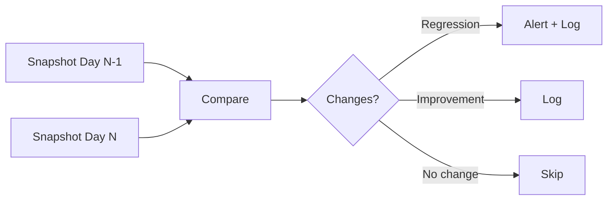

# Compliance Drift

Compliance drift detection monitors your compliance posture over time and alerts when controls regress — catching problems before your next audit finds them.

## How drift detection works

OpsDeck takes weekly automated snapshots of compliance status across all frameworks (every Monday at 9:00 AM local time). Each snapshot captures the status of every control at that point in time. The system then compares consecutive snapshots to detect changes.

## Change classification

| Classification | Description | Severity |
|---|---|---|
| **Regression** | Control status worsened | Critical (→ Non-compliant), High (→ Warning), Medium (other) |
| **Improvement** | Control status improved | Informational |

## Drift timeline

<!-- TODO: screenshot of the drift timeline with event markers and statistics cards -->

The drift dashboard displays a timeline visualization showing changes over configurable periods (7, 30, or 90 days). The timeline includes:

- **Statistics cards** — total regressions, improvements, and net change.
- **Event markers** — each day with detected changes is marked on the timeline.
- **Event details** — click any marker to see the control-by-control breakdown for that day.

## Manual snapshots

In addition to the weekly automated snapshot, you can capture a snapshot manually:

1. Navigate to **Compliance → Compliance Drift**.
2. Click **Capture Snapshot**.
3. The snapshot is compared immediately against the previous one.

This is useful before and after major changes (e.g., deploying a new policy, completing a remediation).

## Alert configuration

Drift alerts are triggered when critical regressions are detected (any control moving to Non-compliant status):

- Logged to application logs for monitoring integration.
- Sent via configured notification channels (email, Slack webhook).
- Visible on the compliance drift dashboard with severity badges.

## Resolving drift

When a regression is detected:

1. Click the drift event to see which controls regressed.
2. Investigate the cause — was evidence removed? Was a linked entity archived?
3. Address the root cause: re-link evidence, update the control status, or create a remediation task.
4. The next snapshot will capture the improvement.

!!! tip
    Drift detection is most valuable when evidence is linked continuously. If you only link evidence during audit preparation, the drift timeline will show a "cliff" before each audit and won't catch regressions between audits.
