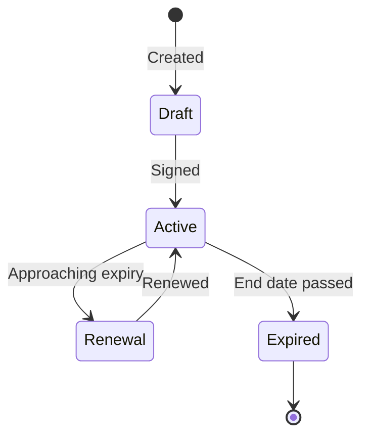

# Contracts

<!-- TODO: screenshot of the contracts list view with status badges -->

Track contract lifecycles with suppliers, including line items, renewal dates, and document attachments.

## Contract lifecycle

## Creating a contract

1. Navigate to **Vendors → Contracts**.
2. Click **Add Contract**.
3. Link to a **supplier**.
4. Set start date, end date, and value.
5. Add **contract items** (line items) with individual descriptions and costs.
6. Upload the signed contract document as an attachment.

## Renewal tracking

- Contracts approaching their end date appear on the dashboard and in renewal reports.
- Notifications are sent before expiry based on configured lead times.
- Renewing a contract creates a new contract record linked to the original.

## Document management

Attach supporting documents to any contract:

- Signed agreements, amendments, SLAs.
- Vendor security assessments.
- Pricing schedules.
