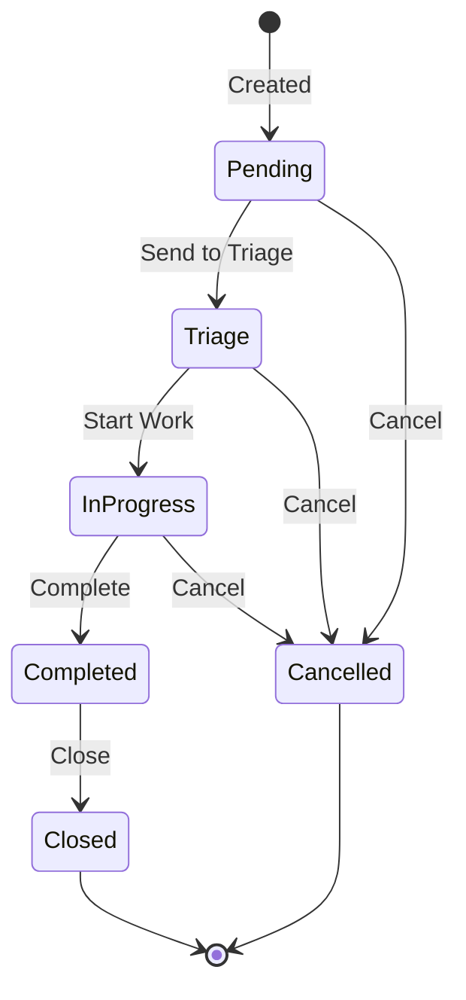

# Service Requests

Submit and track service requests — access, hardware, software, or general help — through a triage-based fulfillment workflow.

Where [Change Management](changes.md) governs planned modifications to infrastructure, **Requests** handle day-to-day fulfillment items raised by users: a new laptop, VPN access, a software install, or an information request.

- **Access**: **Operations → Requests** in the sidebar, or the **Create a Request** quick action on [My Dashboard](my-dashboard.md).
- **URL**: `/requests`
- **Permission**: `operations` module — read access to view, write access to create, edit, and advance requests.

## Creating a request

1. Navigate to **Operations → Requests**.
2. Click **New Request**.
3. Provide:
    - **Title** and **description** of what is being requested.
    - **Request type** — General, Access, Hardware, Software, or Information.
    - **Priority** — Low, Medium, High, or Critical.
    - **Due date** (optional) and **assignee** (optional).
    - **Related item** (optional) — link the request to a business service, asset, or software.
    - **Tags** for categorization.
4. On the **Justification & Resolution** tab, document the business **justification** (Markdown supported). Resolution notes are filled in later, during fulfillment.
5. Submit. The request is created in **Pending** status.

## Request types

| Type | Typical use |
|---|---|
| **General** | Anything that doesn't fit a specific category |
| **Access** | Access to a system, application, or VPN |
| **Hardware** | New or replacement equipment |
| **Software** | Software installation or licensing |
| **Information** | A documentation or information request |

## Request lifecycle

Requests move through a service-desk fulfillment flow:

**Pending → Triage → In Progress → Completed → Closed**

| Status | Meaning |
|---|---|
| **Pending** | Newly submitted, awaiting triage |
| **Triage** | Under review; an assignee is determined and the request is prioritized |
| **In Progress** | Work is actively underway |
| **Completed** | Work is finished; resolution notes are recorded |
| **Closed** | Verified and formally closed |
| **Cancelled** | Withdrawn before completion (off-flow terminal state) |

Each transition records a timestamp (triaged, started, completed, closed) and, for triage, the user who triaged the request. The detail view shows a **status timeline** that visualizes how far the request has progressed through the five stages.

Transitions are sequential and enforced — a request cannot skip from *Pending* straight to *In Progress*, for example. A request can be **cancelled** from any active state via the **More** menu; cancelled, completed, and closed requests can no longer be edited.

## Evidence and attachments

The **Evidence** tab on the request detail view lets you upload supporting files — screenshots, signed approvals, or delivery confirmations. Each attachment is timestamped and downloadable, providing an audit trail for fulfillment.

## Filtering by status

The request list has a **status** dropdown to narrow the view to a single status (for example, only *Triage* items awaiting assignment). The current filter is reflected in the URL and in the dropdown label, so a filtered view can be bookmarked or shared.
