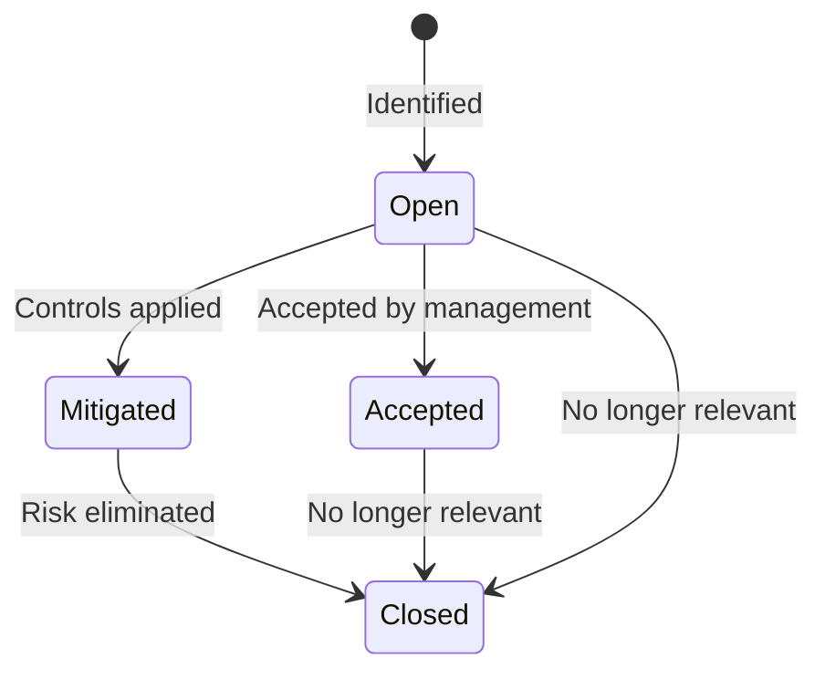

# Risk Register

The risk register tracks identified threats to your organization, their scoring, treatment plans, and evolution over time.

## Creating a risk

1. Navigate to **Security → Risks**.
2. Click **Add Risk**.
3. Fill in:
    - **Title** and **description** of the threat.
    - **Category** — selected from the risk taxonomy (or create a custom category).
    - **CIA classification** — which pillar is threatened: Confidentiality, Integrity, Availability, or a combination.
    - **Owner** — the person responsible for managing this risk.
4. Score the risk (see below).
5. Link affected items — assets, services, suppliers, or compliance controls.

## Risk scoring

<!-- TODO: screenshot of the risk heat map (impact vs. likelihood matrix) -->

Each risk is scored on two axes:

| Dimension | Scale | Description |
|---|---|---|
| **Impact** | 1–5 | Consequence if the risk materializes |
| **Likelihood** | 1–5 | Probability of occurrence |

**Inherent risk** = Impact × Likelihood (before any mitigation).

After documenting mitigating controls (linked security activities), set the **residual risk** — the remaining risk level after controls are applied.

## Risk lifecycle

## Risk history and trending

Every time a risk's score, status, or treatment plan changes, a `RiskHistory` record is created. The risk detail page shows a timeline of changes, enabling trending analysis across review cycles.

## Risk catalog

OpsDeck includes a predefined risk catalog (`CatalogRisk`) with common IT risks organized by category. Use the catalog as a starting point when conducting risk assessments — select relevant risks and add them to your register with organization-specific scoring and context.

## Linking risks to compliance

Risks can be linked to framework controls to show how identified threats map to compliance requirements. Conversely, compliance gaps can generate new risk entries. This bidirectional linking ensures that risk management and compliance management reinforce each other.
