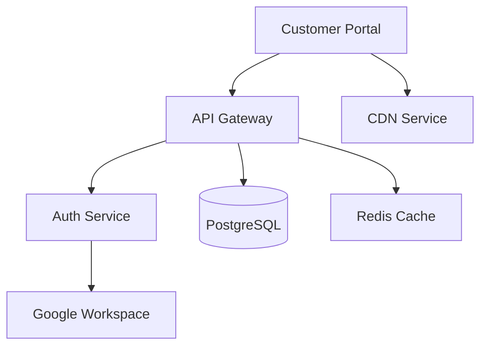

# Service Catalog

The service catalog maps business services to their technical dependencies, enabling impact analysis, compliance tracking, and operational visibility.

## Business services

A business service represents a capability delivered to the organization or its customers — "Customer Portal," "Payment Processing," "HR System," etc.

1. Navigate to **Services → Business Services**.
2. Click **Add Service**.
3. Provide: name, description, owner, and **criticality** (Critical / Non-Critical).

## Service components

Components are the technical building blocks that support a business service:

1. From the service detail page, click **Add Component**.
2. Link:
    - **Assets** — servers, databases, network devices.
    - **Software** — applications running on those assets.
    - **Subscriptions** — SaaS services the business service depends on.
    - **Other services** — upstream or downstream service dependencies.

## Dependency mapping

The topology view shows the complete dependency graph for a service:

The `dependency_graph.py` utility resolves transitive dependencies — if Service A depends on Service B which depends on Database C, the graph shows all three levels.

## Impact analysis

When an incident or change affects a component:

- Navigate to the affected asset or service.
- The **Impact** section shows all business services that depend on it.
- This informs incident severity assessment and change approval decisions.

## Compliance context

Services can be linked to:

- **Policies** that govern the service.
- **Compliance controls** the service must satisfy.
- **Security activities** that protect the service.
- **Risks** that threaten the service.

This provides a unified view of a service's compliance posture.
