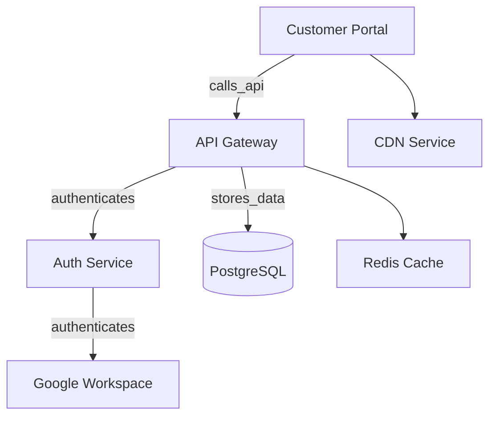

# Service Catalog

The service catalog maps business services to their technical dependencies, enabling impact analysis, compliance tracking, and operational visibility.

## Business services

A business service represents a capability delivered to the organization or its customers — "Customer Portal," "Payment Processing," "HR System," etc.

1. Navigate to **Services → Business Services**.
2. Click **Add Service**.
3. Provide: name, description, owner, and **criticality** (Critical / Non-Critical).

## Service components

Components are the technical building blocks that support a business service:

1. From the service detail page, click **Add Component**.
2. Link:
    - **Assets** — servers, databases, network devices.
    - **Software** — applications running on those assets.
    - **Subscriptions** — SaaS services the business service depends on.
    - **Configuration items** — CMDB configuration records that define the service's setup.
    - **Other services** — upstream or downstream service dependencies.

Linked components appear under the **Infrastructure Components** tab on the service detail page, where each carries a type badge and can be detached.

## Dependency mapping

The topology view shows the complete dependency graph for a service. Each dependency can optionally carry a **relationship type** that describes *why* two services are connected:

### Adding a dependency

1. From the service detail page, click **+** on the **Depends On** or **Supported Services** card.
2. Select the target service.
3. Optionally select a **Relationship Type** from the controlled vocabulary:

| Type | Meaning |
|---|---|
| hosts | Runs or hosts the dependent service |
| authenticates | Provides authentication or identity |
| provides_access | Grants network access (VPN, bastion, proxy) |
| stores_data | Stores or persists data for the service |
| processes_data | Processes transactions or transforms data (payment gateways, ETL) |
| monitors | Monitors health or performance |
| backs_up | Provides backup or replication |
| routes_traffic | Routes or load-balances traffic |
| calls_api | Consumes an API from the service |
| sends_data | Sends data or events to the service |

The label is optional — dependencies without a label appear as plain arrows in the graph. Labels appear as badges in the dependency lists and as edge annotations in the Mermaid topology.

The `dependency_graph.py` utility resolves transitive dependencies — if Service A depends on Service B which depends on Database C, the graph shows all three levels.

## Impact analysis

When an incident or change affects a component:

- Navigate to the affected asset or service.
- The **Impact** section shows all business services that depend on it.
- Labeled dependencies enable more precise impact assessment: "if AWS goes down, services it *hosts* die, but services that only *authenticate* through it may have fallback."
- This informs incident severity assessment and change approval decisions.

## Compliance context

Services can be linked to:

- **Policies** that govern the service.
- **Compliance controls** the service must satisfy.
- **Security activities** that protect the service.
- **Risks** that threaten the service.

This provides a unified view of a service's compliance posture.
