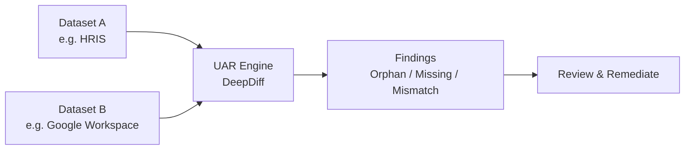

# User Access Reviews

The UAR module automates the comparison of user records between systems to detect orphaned accounts, missing access, and mismatched attributes. It replaces manual spreadsheet-based access reviews with scheduled, repeatable comparisons.

## How it works

A UAR comparison defines two datasets (e.g., HRIS vs. Identity Provider) and the fields to compare. When executed, the UAR engine loads both datasets, matches records by a key field (typically email or employee ID), and generates findings for any discrepancies.

## Finding types

| Type | Description | Severity |
|---|---|---|
| **Orphan** | Record exists in system A but not in system B. Example: employee in HRIS but no Google Workspace account. | Medium |
| **Missing** | Record exists in system B but not in system A. Example: Google account with no matching HRIS record (potential orphaned account). | High |
| **Mismatch** | Record exists in both systems but field values differ. Example: different department or role. | Low–Medium |

## Configuring a comparison

<!-- TODO: screenshot of the UAR comparison configuration form -->

1. Navigate to **Compliance → User Access Reviews**.
2. Click **Create Comparison**.
3. Configure:
    - **Name** — descriptive label (e.g., "HRIS vs Google Workspace Q1 2026").
    - **Dataset A** — source system and data source (CSV upload, API, database query).
    - **Dataset B** — target system and data source.
    - **Key field** — the field used to match records (e.g., `email`).
    - **Comparison fields** — which fields to compare for mismatches (e.g., `department`, `role`, `status`).
4. Save.

## Scheduling automatic execution

Comparisons can be scheduled to run automatically:

1. On the comparison detail page, click **Schedule**.
2. Choose frequency: daily, weekly, or monthly.
3. Select the time of day (UTC).
4. APScheduler triggers the execution automatically.

Each execution creates a `UARExecution` record with its own set of findings.

## Reviewing findings

<!-- TODO: screenshot of the findings list with the side-by-side diff viewer for a mismatch -->

1. Navigate to the execution detail page.
2. Findings are listed by severity with counts per type.
3. For **mismatch** findings, click **View Details** to open the visual diff viewer — a side-by-side comparison highlighting field-by-field differences.
4. For each finding, you can:
    - **Resolve** — mark as addressed.
    - **Mark as false positive** — the finding is expected and not actionable.
    - **Create incident** — escalate to the security incident workflow.
    - **Add comment** — document the resolution or reasoning.

## Bulk remediation

From the findings list:

- Select multiple findings using checkboxes.
- Apply bulk actions: resolve, assign, mark as false positive, export to CSV.
- Bulk operations log each action individually in the audit trail.

## Compliance integration

UAR findings serve as evidence for access governance controls:

- Link UAR executions to compliance controls (e.g., SOC 2 CC6.1, ISO 27001 A.9.2).
- Regular execution provides ongoing evidence that access reviews are performed.
- Findings feed into compliance status — unresolved critical findings may trigger compliance drift alerts.
